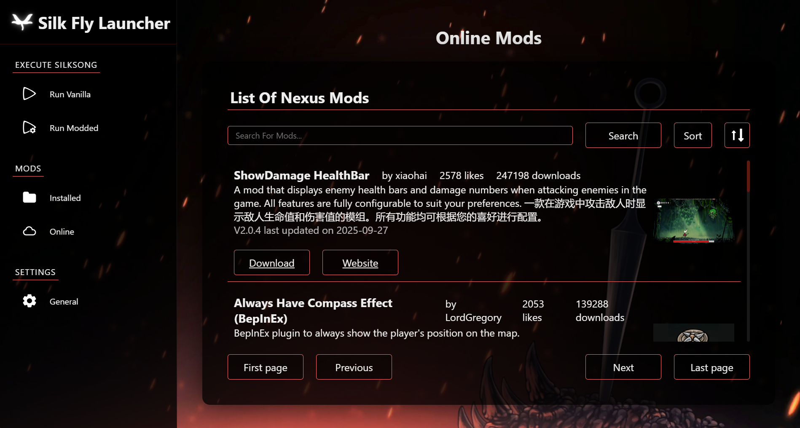
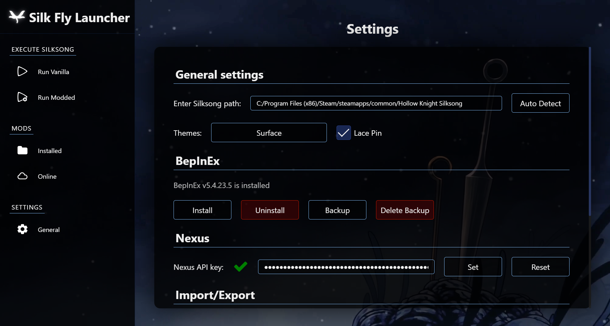
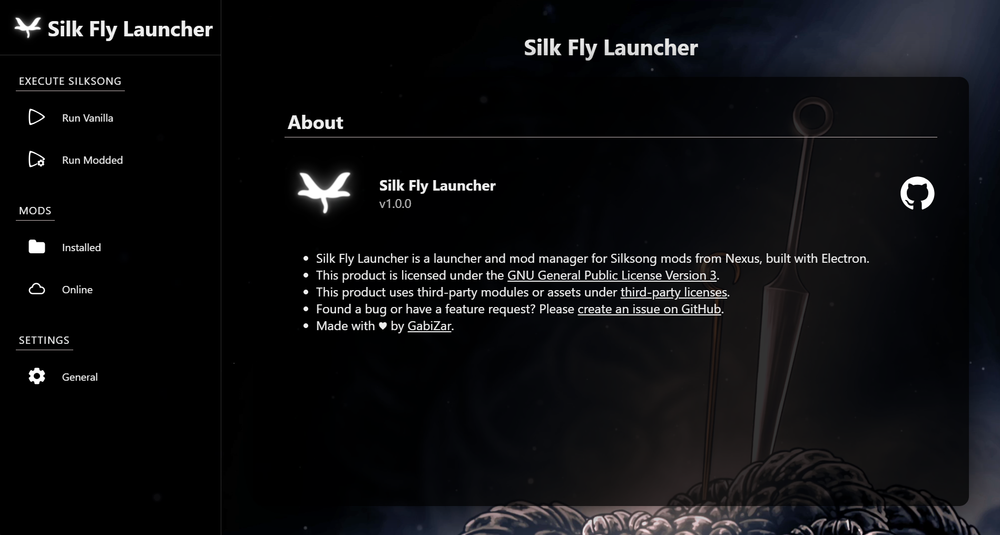
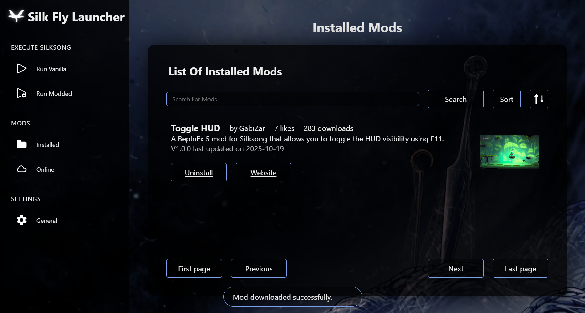
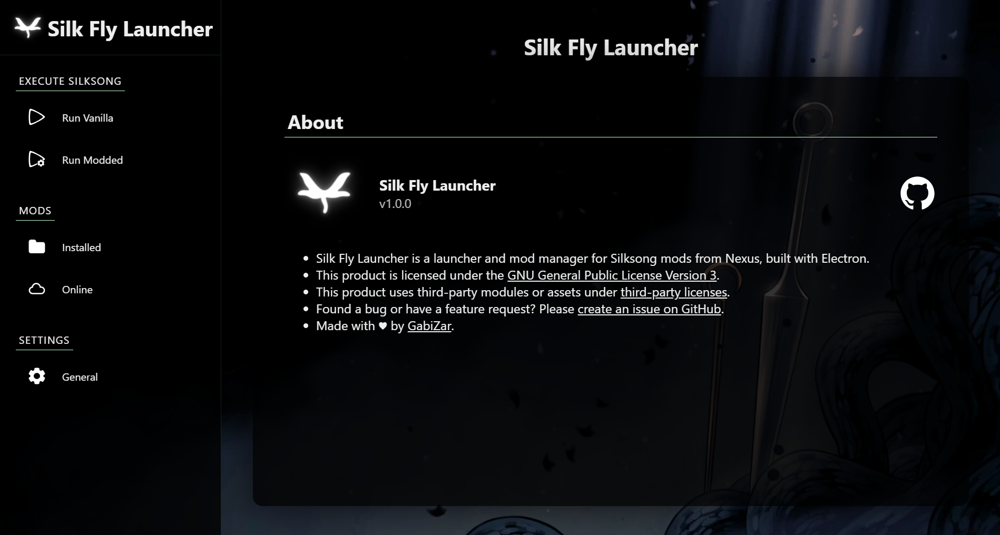
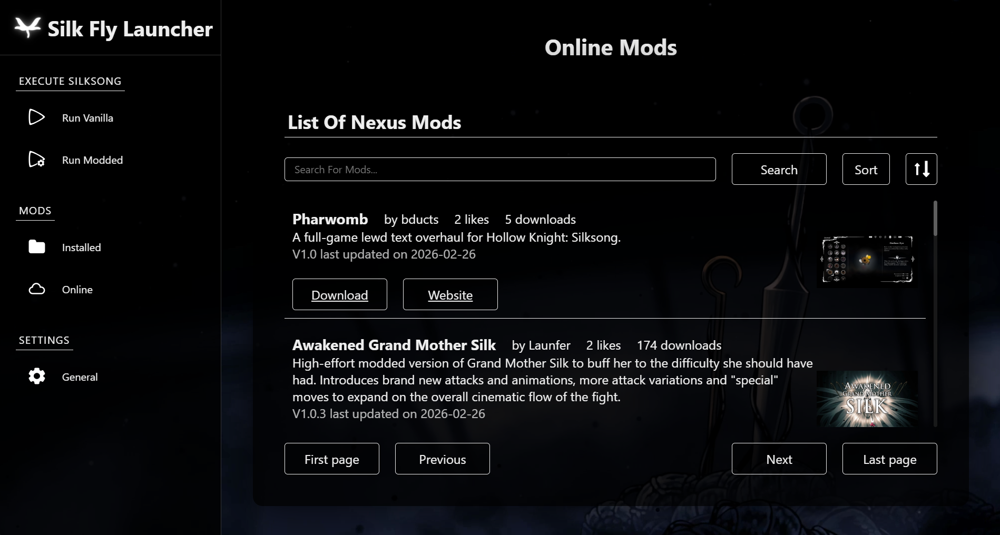

<h1 align="center">Silk Fly Launcher</h1>
<h3 align="center">
  — A Silksong mod manager —
</h3>

<p align="center">
    
    
    
    
    <br>
    <a href="https://github.com/Gabi-Zar"></a>
    
    
</p>

---

Silk Fly Launcher is an open-source mod manager for Hollow Knight: Silksong, designed to simplify installing and managing Nexus Mods.

Built with Electron, it provides a clean UI, secure Nexus API integration, and seamless switching between vanilla and modded gameplay.

<p align="center">
  
</p>

<details>
<summary>More screenshots (click me)</summary>
<p align="center">
  
  
  
  
  
  
  
</p>
</details>

## 🌟 Features

- Install / Uninstall / Backup BepInEx for Silksong.
- Automatically detect Silksong installation path for Steam on Windows
- Browse and download Nexus mods directly in the app
- Multiple themes inspired by Silksong
- Launch Silksong in Vanilla or Modded without deleting the mods
- Securely store your Nexus API key on your device using Electron's safeStorage, and then additionally encrypt it with an AES key (provided at build time) via Electron Store.
- Works on Windows (Linux coming soon)

## 💻 Compatibility

- ✅ Windows x64
- 🛠 Linux (Comming in v1.0.0)
- ❌ macOS (need a tester)

## 🚀 Installation & Usage

1. Download the app in your desired format from the [GitHub Releases](https://github.com/Gabi-Zar/Silk-Fly-Launcher/releases) page or build it from [source](#how-to-build) to have the latest features.

2. Install it and follow the in-app guide

## ⚙️ How to build

1. Install [Git](https://git-scm.com/) and [Node JS](https://nodejs.org)
2. Clone the repo `git clone https://github.com/Gabi-Zar/Silk-Fly-Launcher `
3. Go into the repository `cd Silk-Fly-Launcher `
4. Install npm dependencies `npm install `
5. Start the app with `npm run start `
6. Build the app with `npm run make:options `
7. Available Build options are

```
none - build all
zip - Make a zip for Windows x64
msi - Make a msi build for Windows x64
```

## ✅ Todo

#### For release 1.0.0

- [x] BepInEx support
- [x] Nexus support
- [ ] Disable / Enable Individual mods
- [ ] Support for offline mods
- [ ] Auto Download Mods Dependencies
- [ ] Linux support
- [ ] Automatic update

#### For Later

- [ ] Automatically detect Silksong installation path on other platforms
- [ ] Multiple mods profiles
- [ ] Support for MelonLoader
- [ ] Support for Thunderstore
- [ ] French translation
- [ ] macOS support (need a tester)

## 🤝 Contributing

Pull requests are welcome.
For major changes, please open an issue first to discuss what you would like to change.

## 📜 License and credit

This project is licensed under the [GPL-3.0 license](LICENSE).
This product uses third-party modules or assets under open source [third-party](THIRD-PARTY-LICENSES) licenses

> [!CAUTION]
> Some assets came from Hollow Knight: Silksong.
> Hollow Knight: Silksong is property of Team Cherry.
> This project is not affiliated with or endorsed by Team Cherry.

---

<p align="center">If you like this app, consider giving it a ⭐ on GitHub!</p>
